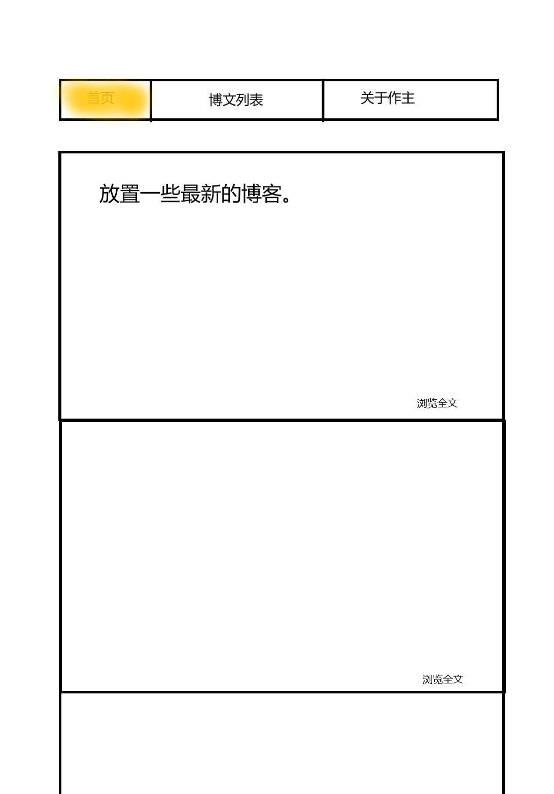

# web前端开发立项报告
## 1.前言：
&nbsp; &nbsp; 本人注意到：正如其名，杭州电子科技大学与电子科技有着十分密切的联系，因而提升学生对电子科技的认识是十分有必要的。一些前沿、理论性的知识已由学校负责，但同学们对电子科技在日常生活中的某些应用（如桌面pc组装、操作系统快捷指令、手机root等）的了解并不全面，因而本博客立志于缓解这些状况。
## 2.网站概述：
&nbsp; &nbsp; 本博客的内容主题定为电子科技在日常生活中的应用知识交流。交流范围限定在杭电下沙校区内。本网站的特点在于博客内容与学校教学内容全面脱节，完全着重于日常生活，通过分享简单、侧重实践的知识方便学生。
## 3.对标网站
&nbsp; &nbsp; [某个单用户博客(来源于微博的一部分)](https://blog.sina.com.cn/s/articlelist_1265722751_0_1.html)  
## 4.内容来源以及素材
&nbsp; &nbsp; 中关村等大型电子产品交流网站，从知乎、B站等多内容网站收集出的内容，博客用户的知识储备等。（详见“素材”）
## 5.基本界面  
  

 

  
## 6.媒体类型说明：
&nbsp; &nbsp; 本网站含有文本、图片、视频。在首页和关于作者页面会有图片与文本。而在博文中可以出现视频。

